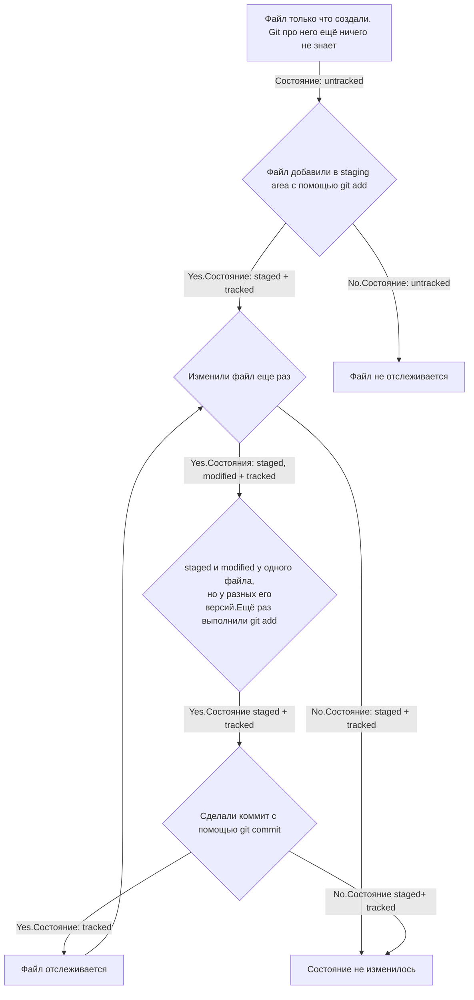

# **ШПАРГАЛКА   ПО РАБОТЕ С Git**  
---

## **Тема №1 Командная строка и начало работы с Git**  

### Система контроля версий, или VCS, — это программное обеспечение, которое помогает отслеживать изменения в программах, текстовых файлах, больших документах, веб-сайтах и так далее.  

Основные функции системы контроля версий:  
* хранит историю изменений в виде отдельных ревизий;  
* позволяет манипулировать историей: например, менять порядок ревизий, полностью удалять версии, возвращаться назад в истории;  
* помогает анализировать изменения: например, кто и когда вносит изменения, кто чаще всего вносит изменения в определённый файл и так далее.  
**Git — один из примеров системы контроля версий: он позволяет хранить, изменять и анализировать историю проекта**.  

### Основные команды командной строки Git Bash:  
1. *pwd* - вывести текущую директорию.  
2. *cd ~* - вывести домашнюю директорию.  
3. *ls* - вывести содержимое текущей папки, с флагом -a выводится расширенный список со скрытыми файлами.  
4. *cd "название папки, путь"* - сменить директорию, если в названии есть пробелы, то оно записывается в кавычках, cd .. - переход на уровень выше., cd . - обратиться к текущей директории.  
5. *touch*- создание файла.  
6. *mrdir* - создание папки, с помощью флага -p создается структура директорий.  
7. *cp что_копируем куда_копируем* - копирование файлов (папок).  
8. *mv - что_перемещаем куда_перемещаем* - перемещение файлов (папок).   
9. *cat* - чтение файлов (только с текстовыми файлами).  
10. *rm* - удаление файла (папки), с флагом -r - удаление папки с содержимым, рекрсивное удаление.  
11. *rmdir* - удаление пустой папки.  
12. *&&* - с помощью разделителя в виде двух амперсандов можно выполнять список команд.  

### Основные команды работы с Git:  
1. *$ git version* - вывести текущую версию установленного Git.  
2. *$ git config --global user.name "User Namovich"* (имя или ник нужно написать латиницей и в кавычках).  
*$ git config --global user.email username@yandex.ru* (здесь нужно указать свой настоящий email).  
3. *$ cat ~/.gitconfig*  или *$ git config --list*  - проверка настройки Git.  

### Команды инициализации Git:  
1. *$ git init* - создание репозитория из текущей папки.  
2. *$rm -rf .git* - способ "разгитить" репозиторий.  
3. *$ git status* - проверка состояния репозитория (название текущей ветки, коммиты).  
4. *$ git add файл.html (--all)* - подготовка к сохранению файла (всех файлов git add .).  
5. *$ git commit файл.html -m* "Содержание изменения" - сохранение файла.  
6. *$ git log* - просмотр истории коммитов.  

## **Тема №2 Начало работы с GitHub**  

### GitHub — платформа для хранения IT-проектов и совместной работы над ними с использованием Git.  
### Типы проектов GitHub: приватный, командный, публичный.  
### Порядок создания репозитория:  
1. Создать удаленный репозиторий на сайте GitHub.  
2. При необходимости сгенрировать SSH-ключи (от англ. Secure Shell Protocol).  
SSH использует пару ключей для обеспечения безопасности — публичный и приватный:  
Приватный ключ (англ. private key) хранится только на вашем компьютере и не должен передаваться кому-либо ещё. Он используется для шифрования данных.  
Публичный ключ (англ. public key) доступен всем и используется для расшифровки данных, которые были зашифрованы приватным ключом.  
*$ ls -la .ssh/* - проверка наличия созданных ключей в домашней директории.  
*$ ssh-keygen -t ed25519 -C "электронная почта, к которой привязан ваш аккаунт на GitHub"* - генерация SSH-пары ключей (возможно потребуется изменить алгоритм шифрования  rsa -b 4096), использование кодовой фразы не обязательно.  
*$ clip < ~/.ssh/id_ed25519.pub*  -  скопировать содержимое ключа в буфер обмена:  
*$cat ~/.ssh/id_ed25519.pub* - либо вывод на экран.  
В меню Settings GitHub в пункте SSH and GPG keys выбрать New SSH key. В поле Title написать название ключа. В поле Key type должно быть Authentication Key. В поле Key скопировать ключ из буфера обмена, затем Add SSH key.  
3. *$ ssh -T git@github.com.*  - проверка правильности ключа.  
4. Перейти на страницу удалённого репозитория, выбрать тип SSH и скопировать URL. Затем перейти в каталог (папку) локального репоизтория и ввести:  
*$ git remote add origin git@github.com:ИМЯ_АККАУНТА/название_проекта.git.*  
5. Проверка того, что репозитории связаны:  
*$ git remote -v*, должно быть:  
*origin    git@github.com:%ИМЯ_АККАУНТА%/%ИМЯ-ПРОЕКТА%.git (fetch)*  
*origin    git@github.com:%ИМЯ_АККАУНТА%/%ИМЯ-ПРОЕКТА%.git (push)*  
6. *$ git push -u origin master* - отправка изменений на удаленный репозиторий.  
### Содержание файла README.md.  
Название проекта и его краткое описание: кем создан, для чего, какие решает задачи и какие закрывает проблемы.  
Технологии, которые применяются в проекте. В чём его отличие от аналогичных.  
Документация проекта — подробная инструкция о том, что представляет собой проект.  
###  Хеш — идентификатор коммита  
**Хеширование (от англ. hash, «рубить», «крошить», «мешанина») — это способ преобразовать набор данных и получить их «отпечаток» (англ. fingerprint).**  
Git хеширует (преобразует) информацию о коммите с помощью алгоритма SHA-1 (от англ. Secure Hash Algorithm — «безопасный алгоритм хеширования») и получает для каждого коммита свой уникальный хеш — результат хеширования.  
Все хеши, а также таблицу соответствий хеш → информация о коммите Git хранит в папке .git.  
**$ git log --oneline** - получение сокращенного лога.  
Файл HEAD (англ. «голова», «головной») — один из служебных файлов папки .git. Он указывает на коммит, который сделан последним (то есть на самый новый).  
### Статусы файлов в репозитории  
* **untracked** - неотслеживаемый.
* **staged** - подготовленный, после выполнения команды **git add** файл попадает в staging area, то есть в список файлов, которые войдут в коммит. Staging area также называют index (англ. «каталог») или cache (англ. «кеш»), а состояние файла staged иногда называют indexed или cached.  
* **tracked** - отслеживаемый, в него попадают файлы, которые уже были зафиксированы с помощью git commit, а также файлы, которые были добавлены в staging area командой git add.  
* **modified** - измененный, Git сравнил содержимое файла с последней сохранённой версией и нашёл отличия.  
###   Жизненный цикла файла Git  

Состояния файла в git status:  
* staged (Changes to be committed в выводе git status);  
* modified (Changes not staged for commit);  
* untracked (Untracked files).  
Jira — система для организации проектов и задач.  
Стандарт Conventional Commits, формат коммита: < type >: <сообщение>.:  
* feat (англ. «навык») — для новой функциональности;  
* fix (от англ. «исправить», «устранить») — для исправленных ошибок.  
### Внесение в правок в commit  
Команда **git commit --amend --no-edit** - внести правки в уже сделанный последний коммит, например дополнить изменение забытым файлом, при этом последняя опция говорит, что сообщение коммита менять не нужно.  
* Команда **git commit --amend -m "новое сообщение"** - внести правки в сообщение о коммите.  
* Команда **git restore --staged file** - убрать файл из коммита (staging area).  
* Команда **git reset --hard commit hash** - "откатить" то, что уже было закоммичено, возвращение репозитория к более раннему, при этом вся дальнейшая разработка будет вестись от файла с указанным хешем. Файл вернется к тому состоянию, в котором был в момент этого коммита. Более поздние коммиты Git удалит.  
* Команда **git restore file** - отменить изменения файла modified.  
* Команда  **git diff** - просмотреть изменения файла в сравнении с последней закоммиченной версией (git diff A B - превращение состояния А в В).  
* Команда **git diff --staged** - просмотр изменений в файлах добавленных в коммит.  
* Команда **echo "Новая строка" >> file.txt** - запись в файл дополнительной строки (если использовать символ ">" то исходный текст в файле будет стерт).  
* файл .gitignore - файл, в котором находится информация о файлах, изменения которых не должны отслеживаться git (#комментарии, .new_file, * - игнорировать файлы "tmp" во всех подпапках папки docs docs/*/tmp (для шаблонов), ? - любой один символ, [...] - один символ из списка в квадратных скобках, / - обозначение каталогов, ** - вся вложенная структура, ! - инвертирование правил).  
* команда **git  status --ignored** - отобразить все игнорируемые файлы.  

## **Тема №3 Работа с ветками** 

## **Тема №4 Совместная работа в Git**  